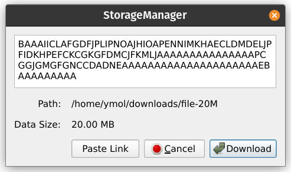

Downloading data from Drives is done on the **Download** tab. Downloads are performed using the lower level [Download Channel](../built_in_features/drive/lifecycle.md#download) mechanism, which is managed automatically by the application.

<figure>
  
  <figcaption align="center">Download Tab</figcaption>
</figure>

# Download Tab Interface Overview

The interface of the **Download** tab consists of the main area in the center of the window, which shows the list of the downloads and their progress, and three buttons: **[ + ]**, **[ – ]**, and **Open Download Folder**.

<figure>
  
  <figcaption align="center">Download Tab with some completed and ongoing downloads</figcaption>
</figure>

- `[+]` is used to add new downloads. They will appear in the main area in the center of the window and will be launched immediately.

- `[–]` is used to remove download entries from the list. *This button does not stop nor interrupt the downloading progress.*

- `Open Download Folder` opens a local download folder in the default file manager of your OS. This is a folder in which all your downloaded data will be saved. You can change this folder in the [Settings](getting_started.md#configuring-network-settings) at any time.

# Downloading Workflow

## Obtaining a Download Link

To create a new download, you first need to have a **Download Link** that contains complete information about what specifically is going to be downloaded, from which Drive, and under which name it is going to be saved in the local download folder.

If you are planning to download from one of your own Drives, you can [generate a Download Link](./managing_drives.md#copying-download-link) on the **Drives** tab.

If the Drive from which you are going to download the data is not yours, the Owner of that Drive must share their Download Link with you in order to let you download the data from their Drive.

## Adding a New Download

To add a new download, click the **[ + ]** button in the bottom left part of the window. A new dialog box will appear.

If you had a valid Download Link in your clipboard at this point, it will appear in the copyable text field inside the dialog box, and the download information encoded in the link will also be shown.

<figure>
  
  <figcaption align="center">Download dialog with an automatically pasted valid link to a file</figcaption>
</figure>

<figure>
  
  <figcaption align="center">Download dialog with an automatically pasted valid link to a folder</figcaption>
</figure>

If you had an **invalid** Download Link in your clipboard, it also will be automatically pasted in the text field of the dialog box, but no information about the download data could be shown in this case:

<figure>
  
  <figcaption align="center">Download dialog with an invalid link</figcaption>
</figure>

>**Note**\
The text field of the dialog box is copyable, but not editable. To update it, copy a valid Download Link to the clipboard and click the **Paste Link** button in the dialog box.

With a valid Download Link pasted, double-check the download information and click the **Download** button once you are ready. This will close the dialog, add the newly created download to the list of downloads in the main area of the window, and immediately launch it. As it is being downloaded, you will be able to see its progress in percent.

>**Note**\
Despite the fact that the download path is hard-coded in the Download Link, the User Application checks for potential name conflicts and adds suffixes to the downloaded files and folders when it is necessary. You don't have to worry about data overwriting in the local download folder.

## Removing Download Records

To remove from the main area of the window a download record that is no longer needed, select it with a single left click and then click the **[ – ]** button in the bottom left part of the window. You will be prompted to confirm the deletion:

Click **OK** to confirm your decision. After this, the selected download record will be instantly removed from the list.

>**Note**\
Download records are stored locally, and their deletion does not require sending any transactions. Because of that, their removal is instantaneous and free.
