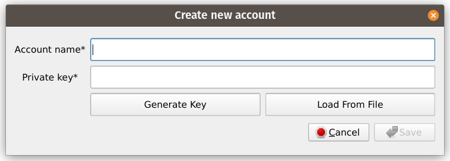
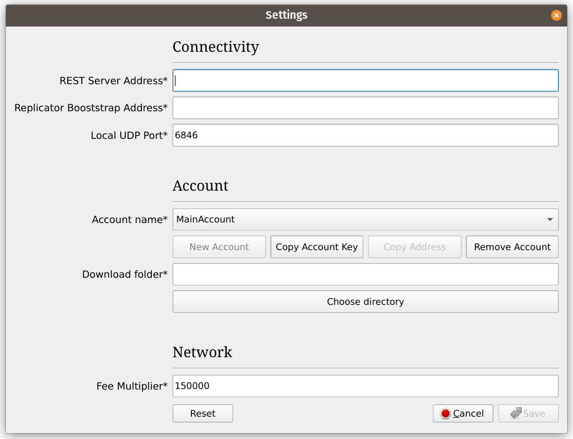
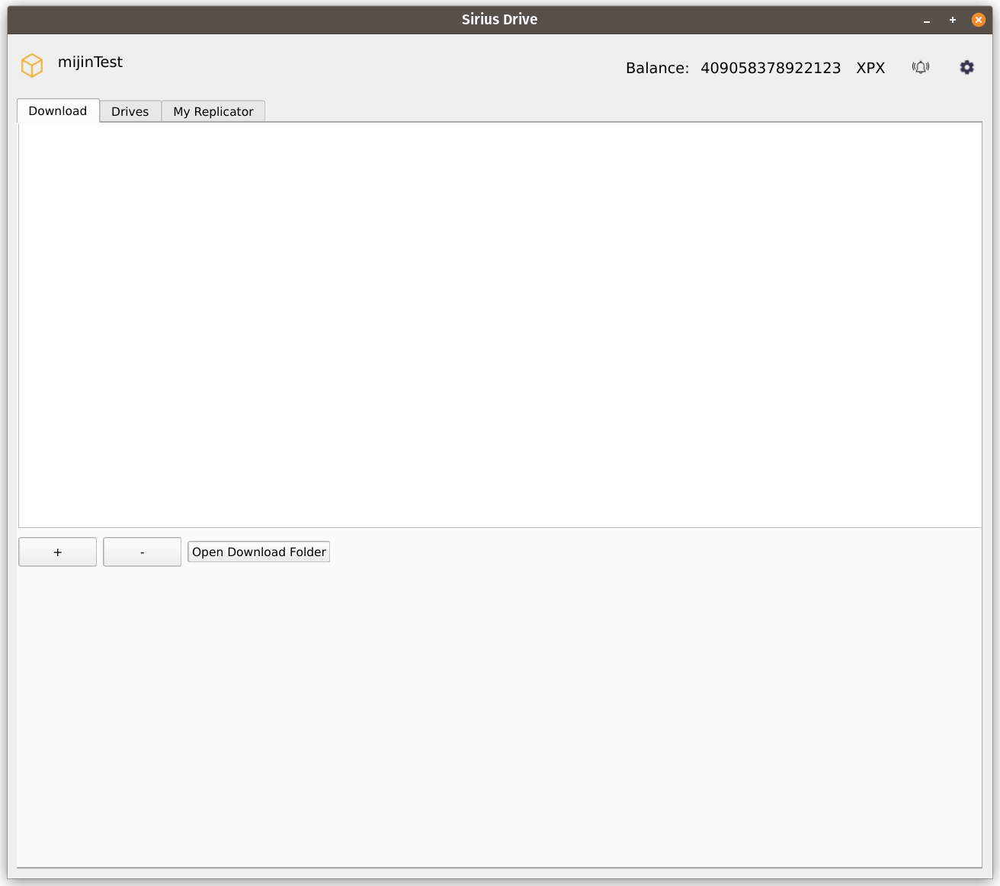
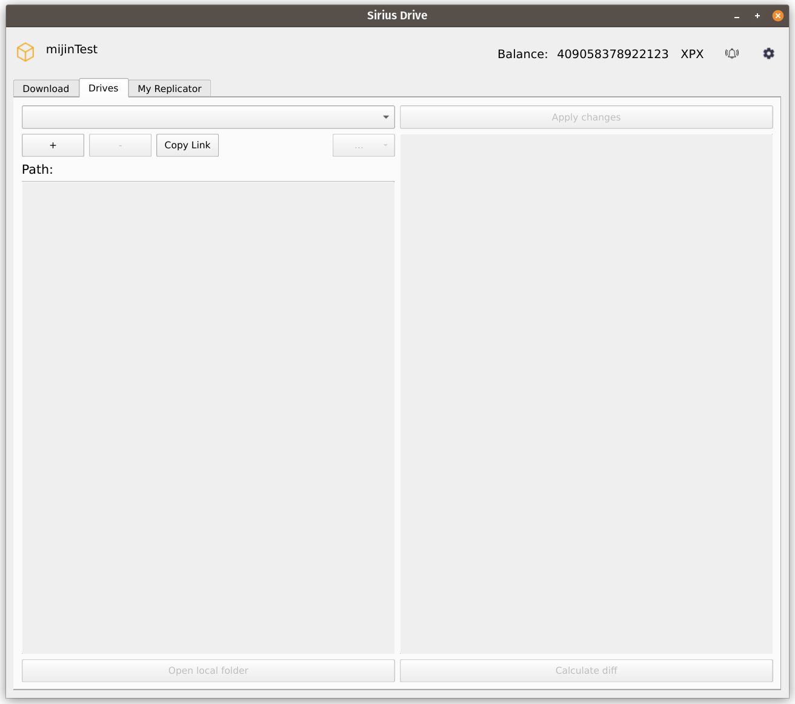
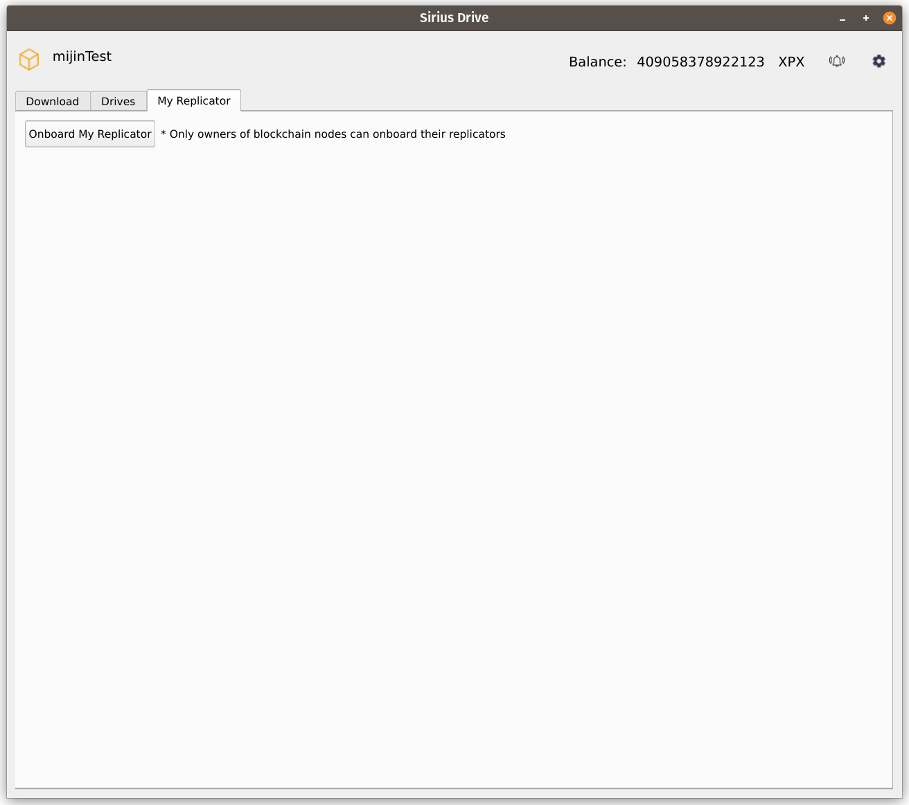

> The [User Application](./overview.md) must be built from sources from the following repository: https://github.com/proximax-storage/cpp-xpx-storage-user-app. Build instructions are available in the `README.md` file. Currently supported platforms are Linux and MacOS.

# First Launch

## Logging In

When you launch the User Application for the first time, you will be prompted to log in into an account:

To proceed, you must fill in both fields.

- `Account name` is a human-readable name of the account. The User Application will let you store and switch between multiple accounts, and these names will be used to differentiate between them. *The name must be no longer than 40 characters and may only contain alphanumericals and underscores (`A–Z`, `a–z`, `0–9`, and `_`).*

- `Private key` is a private 32-byte key of the account.
    - If you have an existing account, you can manually paste its private key in hexadecimal format in this field. Alternatively, you can load the key from a binary file using the **Load From File** button, which will fill in this field automatically. The key should look like this: `5af109f82c2f48f48236855651816f2911f8ff74ca954bb79fc48359274763f7` (both lower-case and upper-case digits `a-f` are supported).
    - If you do not have an account, you can click **Generate Key** button to generate a new key. It will immediately appear in the `Private key` field.

Click **Save** when you are ready. This will bring you to the [Settings](#configuring-network-settings) window.

## Configuring Network Settings

After creating and saving your first account, you will be prompted to fill in network-related settings to complete the setup. All of the fields in this window are required, but some of them already have default values filled in.

- `REST Server Address` and `Replicator Booststrap Address` are, respectively, IP addresses, together with ports, of the REST server and any of the bootstrap replicators of the network you want to connect to. They must be in the following format: `18.142.186.205:3000`.

- `Account name` is your current account. At this point you only have one account, which you created at the [previous stage](#logging-in), but after completing the setup you will be able to create other accounts and switch between them in this drop-down list.
    - **Copy Account Key** button copies a *public* key of the selected account to the clipboard.

- `Download folder` is a directory where the files will be downloaded via the [Download Tab](./downloading_data.md) of the application. It is preferable (though not required) to select an empty directory for this.

> **Note**\
`Local UDP Port` and `Fee Multiplier` fields should be left at their default values.

When you are ready, click **Save** to complete the setup and proceed to the main window of the User Application.

# User Interface Overview

The main window of the User Application has three tabs dedicated to managing your [Downloads](./downloading_data.md), [Drives](./managing_drives.md), and your own [Replicator](../built_in_features/replicator/overview.md), which do not contain anything useful at this moment:

<figure>
  
  <figcaption align="center">Download Tab</figcaption>
</figure>
<figure>
  
  <figcaption align="center">Drives Tab</figcaption>
</figure>
<figure>
  
  <figcaption align="center">My Replicator Tab</figcaption>
</figure>

Regardless of the currently opened tab, the upper part of the window contains information about the network you are currently connected to (in the upper left corner, `mijinTest` in this example) and your current account balance (in the upper right corner).

Additionally, there are two buttons in the upper right corner: **Notifications** (bell icon) and **Settings** (gear icon).

- Clicking **Notifications** icon shows a list of all notifications that the User Application has received during this session.

- Clicking **Settings** icon opens up the [Settings](#configuring-network-settings) window. Now, unlike the first launch, **New Account** button will be active, allowing you to add other accounts. This is done by using the [same dialog](#logging-in) as during the initial setup. To switch  between accounts, use the drop-down menu and select an account you want to switch to. *Please note that after making any changes in the settings (including switching accounts) the application will automatically restart.*

