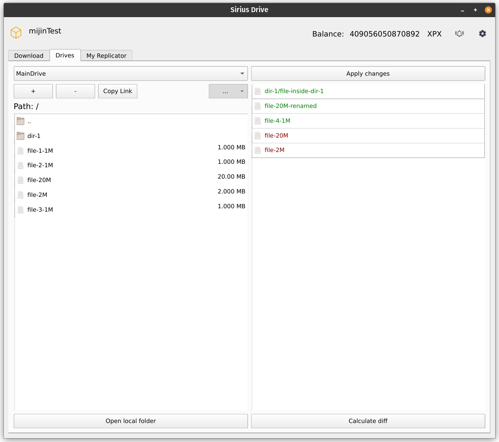
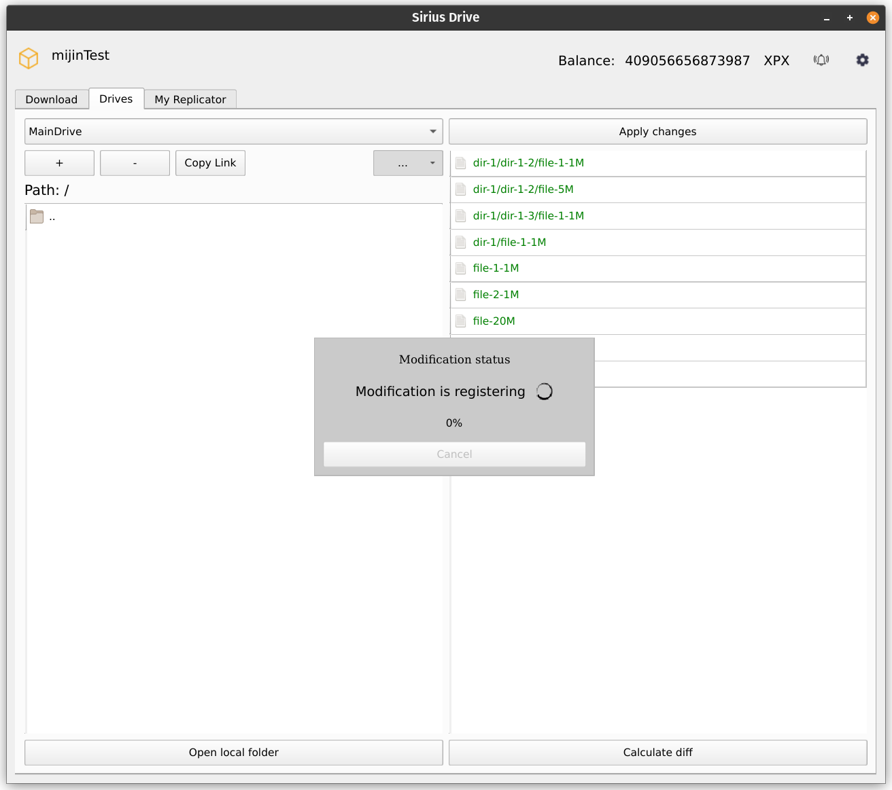
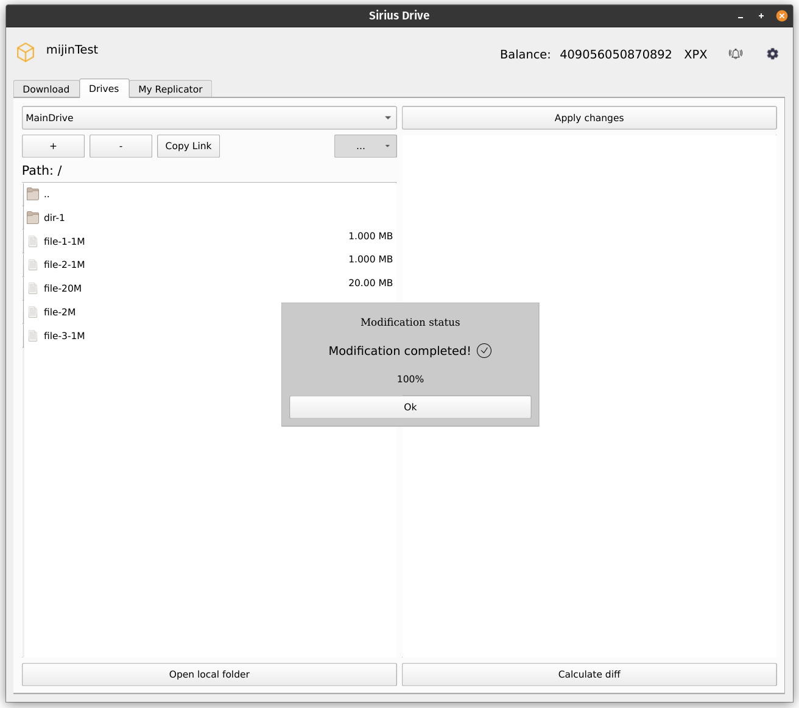

The main portion of the **Drives** tab of the User Application is used to track and manage the state of the [local drive folder](./managing_drives.md#creating-a-new-drive) and the state of the [Drive](../built_in_features/drive/overview.md) stored by [Replicators](../built_in_features/replicator/overview.md).

# Drives Tab Interface Overview

<figure>
  
  <figcaption align="center">Drives Tab showing changes in the local folder (on the right) ready to be applied</figcaption>
</figure>

**Drives** tab is split vertically into the left and right part.

The left part represents **the state of the Drive currently stored by Replicators** that are assigned to this Drive. If your Drive has folders, you can navigate them by using double-clicks. Double-clicking **[ .. ]** returns you to a parent folder.

The right part shows **a difference between the local drive folder and the state of the Drive stored by Replicators**. Files that exist locally but are not uploaded to the Drive are shown **in green**; respectively, files that do not exist in the local drive folder but are still stored by Replicators are shown **in red**. *Note that renamed or moved files are not shown explicitly; instead, the old name or path of the file is shown in red, and the new one is shown in green.*

> **Note**\
Only proper files are actually stored on the Drive. Folders only serve as parts of the file's names and are not uploaded on their own. Empty folders are always ignored when calculating the difference between the local and remote state of the Drive.

There are also three buttons available on this tab:

- `Open local folder` opens a local drive folder in the default file manager of your OS.

- `Calculate diff` manually recalculates the difference between the local and remote state of the Drive and updates the right part of the tab.

- `Apply changes` uploads the changes from the local drive folder to the remote by sending an automatically formed **Data Modification** transaction to the Blockchain.

# Data Modification Workflow

Updating the state of your Drive consists of two steps: updating the state of your local drive folder, and then applying the changes to the remote Drive.

> **Note**\
If you want to update your local files to match the state of a Drive, you need to use [Download tab](./downloading_data.md) instead.

## Updating Local Drive Folder

The local drive folder is updated outside of the User Application. Use any file manager of your choice to add, remove, or update your files.

As the state of your local drive folder changes, the right part of the User Application updates correspondingly, showing current differences between the local folder and the remote state of the Drive in real time.

> **Note**\
Most changes of the local drive folder are tracked automatically in the User Application. However, making changes in subfolders require manual difference recalculation. Use the **Calculate diff** button when you don't see all of the changes that have been made to the local folder in the right part of the tab. *Remember that empty folders are not uploaded to the Drive and will not appear in the right part of the tab.*

## Applying Changes

When your local drive folder is in a desired state, use **Apply changes** button in the top right part of the window to upload the changes to the Drive.

Clicking **Apply changes** will automatically generate and send a Data Modification transaction. It will also create a new frame within the window that will show the current state of the data modification:

Every modification goes through three states: **registering**, **uploading** and **completing**.

While modification is being uploaded, the frame will show upload progress in percent. During this time you are also able to cancel the modification by clicking the **Cancel** button within the frame. As soon as the modification reaches the completing state, the cancellation is no longer available.

> **Note**\
Cancelling a modification involves sending a transaction. Make sure that you have enough XPX to be able to pay for it.

After the modification is completed, the left and right parts of the tab will update. The state of the Drive on the left will now be the same as one of the local folder, and there will be no differences shown in the right part of the window:

